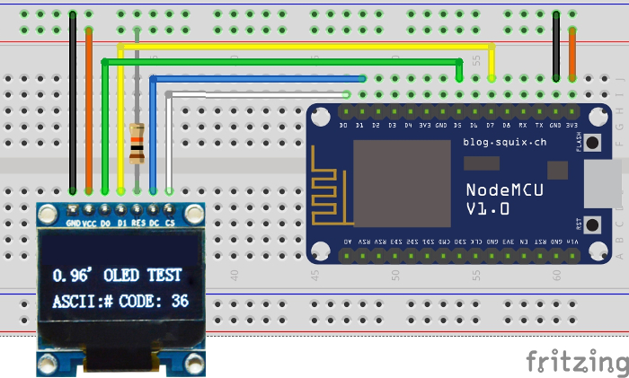

# Time Bomb...

... aka remaining quiet days until birth!

Please note, it's quick and dirty code with quick and dirty calculations.
It was made just for fun!

Displays the number of days left until birth as well as the number of "weeks without period" which is the counting base in the french medical system.

It is easy enough to modify to display whatever calculation you like.

The NTP Library is embedded in the code. The Library for the display can be downloaded here : https://github.com/sumotoy/SSD_13XX

Hardware used :
* Nodemcu 1.0 (but any ESP8266 breakout with enough pins should do)
* 0.95 Inch 7pin 65K Color SSD1331 SPI OLED Display
* Power bank (optional)

Corresponding blog entry: http://www.guillier.org/blog/2017/04/time-bomb/

